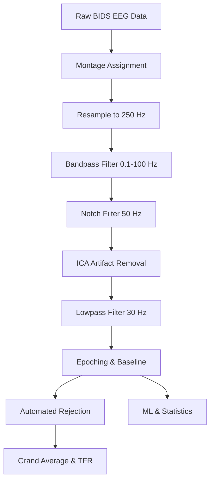

# NeuroSimha EEG Analysis Pipeline

## Overview
This repository contains the advanced EEG data processing and analysis pipeline for the NeuroSimha project. The pipeline translates BIDS-compliant raw EEG data into publishable statistical analyses, machine learning decoding models, and comprehensive Time-Frequency Representations (TFR).

## Architecture & Preprocessing Flow



## Data Acquisition & Folder Structure

For the scripts to function, the dataset must be downloaded and placed correctly within the project root.

1. **Download**: Obtain the Casinos Task dataset from [NEMAR (ds004147)](https://nemar.org/dataexplorer/detail?dataset_id=ds004147).
2. **Placement**: Unzip the dataset into a `data/` folder in the project root.
3. **Paths**: The scripts intelligently search for the BIDS root. They first check for `./data/ds004147/`; if not found, they use `./data/` directly.

Ensure your directory structure looks like this (either option works):

**Option A (Nested):**
```text
EEG-Project/
└── data/
    └── ds004147/            <-- BIDS root
        ├── dataset_description.json
        └── ...
```

**Option B (Root):**
```text
EEG-Project/
├── data/                    <-- BIDS root
├── scripts/                 <-- All analysis scripts
│   ├── preliminary-analysis-script_v3.py
│   ├── complete-analysis-script_v3.py
│   └── check_epoch_rejection.py
├── results/                 <-- Generated output
└── good_subjects.json       <-- Auto-generated by preliminary script
```

## Setup & Dependencies

This project primarily utilizes `uv` for high-performance dependency resolution.

### Using `uv` (Recommended)

1. **Initialize the project** *(Not needed as it is already initialized)*:
   ```bash
   uv init
   ```

2. **Install all packages at once**:
   ```bash
   uv add mne mne-bids mne-icalabel numpy scipy matplotlib pandas autoreject seaborn ipython jupyter black
   ```

3. **Sync dependencies**:
   ```bash
   uv sync
   ```

### Using Standard Python / pip (Backup Method)

If you are not using `uv` on your system, you can easily install the exact dependencies via the provided `requirements.txt` fallback:

```bash
pip install -r requirements.txt
```

## Execution Instructions

*Note: It is heavily recommended to remove the old `results` folder before starting a fresh analysis to ensure clean graphical outputs.*

### 1. Preliminary Analysis
Validates subject-level data integrity, asserts BIDS formatting correctness, and checks epoch retention thresholds.

**With `uv`:**
```bash
uv run python scripts/preliminary-analysis-script_v3.py
```
**With standard Python:**
```bash
python scripts/preliminary-analysis-script_v3.py
```

### 2. Complete Analysis
Executes the comprehensive pipeline including Independent Component Analysis (ICA), Grand Average wave extraction, TFR mapping, Machine Learning decoding, and robust statistics.

**With `uv`:**
```bash
uv run python scripts/complete-analysis-script_v3.py
```
**With standard Python:**
```bash
python scripts/complete-analysis-script_v3.py
```

## Example Visualizations

The pipeline generates publication-ready figures representing every level of the dataset. Below are critical examples of the deliverables:

### 1. Preliminary Analysis (Data Quality Validation)


### 2. Single Subject Preprocessing Dashboard (e.g. sub-27)


### 3. Grand Average: Spatial Topography & ERP Waveforms


### 4. Grand Average: Time-Frequency Representations (TFR)


### 5. Grand Average: Robust Statistics (Paired Comparisons)


### 6. Machine Learning Decoding (Single-Trial)


### 7. Methodological CSV Export
[View Example Methodology Trace](results/complete_analysis/sub-27/methodology.csv)

Access the website version of report here - https://eeg-neuro-simha.vercel.app/
